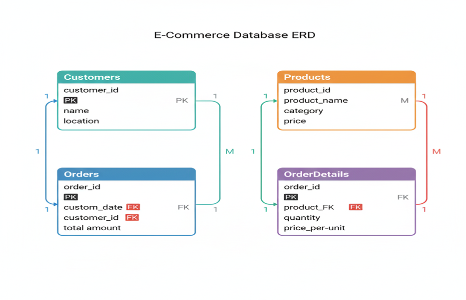

# 🛒 E-Commerce Sales Analysis using SQL

## 📊 SQL Project Portfolio  
**Data-driven insights that improve personalization, retention, and customer lifetime value (CLV).**

---

## 📌 Executive Summary

### Project Overview
This project analyzes **customer behavior, product performance, sales trends, and inventory patterns** using **SQL**.

The goal is to help stakeholders make **data-driven decisions** in:
- Marketing strategy
- Inventory planning
- Sales optimization

The analysis is performed using four core datasets:
- **Customers**
- **Products**
- **Orders**
- **OrderDetails**

---

## 🗂️ Database Schema



---

## 📈 Data Analytics Dashboard Visualization


---

## 🏢 Business Context

Our e-commerce organization relies on transforming raw database data into **actionable insights**.  
As a **Data Analyst**, my responsibility is to support:

| Business Area | Focus |
|--------------|------|
| Customer Insights | Demographics & Behavior |
| Product Analysis | Best Sellers & Trends |
| Sales Optimization | Revenue & Growth |
| Inventory Management | Stock Levels |

---

## 🎯 Key Objectives

- Identify **high-value customers** contributing the most revenue
- Segment customers by **behavior, location, and buying patterns**
- Understand **customer retention** and purchase frequency
- Detect **high-growth customer regions**
- Support **personalized marketing strategies**

---

## 👥 Customer Insights

### 📍 Demographics & Location Analysis

**Goal:** Identify cities with the highest number of customers to plan targeted marketing.

```sql
SELECT location, COUNT(customer_id) AS total_customers
FROM Customers
GROUP BY location
ORDER BY total_customers DESC;
